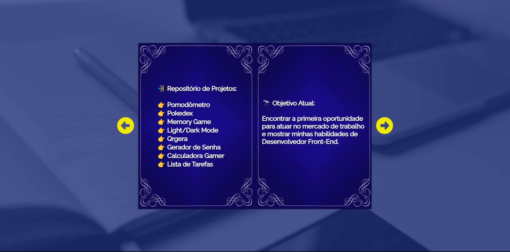

# Profile Card

Deploy: https://profile-card-one-mocha.vercel.app/

## Sobre

É um livro 3D que exibe meu perfil com alguns projetos do meu portifólio no Github, assim como as minhas habilidades.

### Objetivos

Aprender a manipular efeitos 3D usando CSS e JS, criando uma experiencia suave e dinâmica. Criar um cartão dinâmico e criativo para apresentação do meu portifólio e minhas habilidades.

### Desafio

Desenvolver mais um projeto usando Javascript, pois é uma linguagem que estou em constante aprendizado para melhor um pouco a cada projeto.

### Conclusão

Mais um projeto muito instrutivo e divertido de codar. Aprendi novas funcionabilidades do CSS e também do Javascript que serviram para serem aplicados me trabalhos e projetos futuros.

### Ferramentas Utilizadas

- HTML
- CSS
- Javascript
